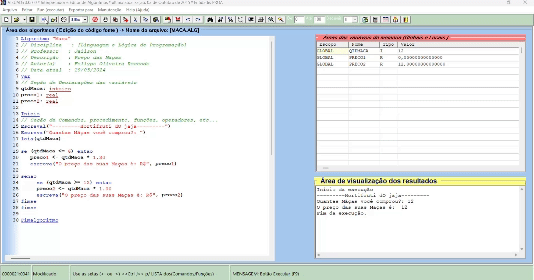

# Lógica de Programação em VISUALG

 
 
 - **Exercícios de Lógica de Programação que envolvem:** Tipos de Dados, Operações aritméticas, Estruturas de controle e Laços de repetição.

 - Exercícios realizados durante o curso PROPROFISSÃO.

## Tecnologias
- VISUALG
- Lógica de Programação

## Contato
[(LinkedIn)](https://www.linkedin.com/in/fellype-oliveira-920699230/)
-----
fellypeoliveira2020@gmail.com